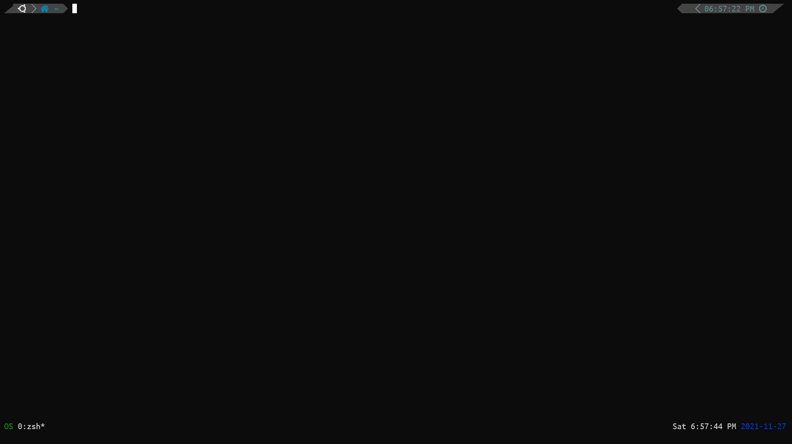

# SmartCd - A Mnemonist `cd` Command

## Description

A `cd` command with improved usability features, which can remember your recently visited directory paths and, search and directly traverse to sub-directories and as well as parent directories, all with Fuzzy searching.

## Features

- If the provided argument is not present in your `$CDPATH`, then `smartcd` will search all the sub-directories and will prompt you with a list containing relative paths to the sub-directories that matched the provided argument (also perform substring comparison), where you can Fuzzy search and automatically traverse to the selected one.

  

- `smartcd` can also remember the last 20 unique visited directory locations, where also you can Fuzzy search and automatically traverse to the selected one.

  Use `cd --` for fzf list of last 20 unique visited paths.

  

## Why SmartCd

Initially, I tried `enhancd` which is a very good alternative for the inbuilt `cd` command, but the features of `enhancd` were more than enough for me and also I had to change my familiarity and regular habit with using some of the options or arguments that are often used with the inbuilt `cd` command, just to familiarize and adapt with the tool.

I wanted to keep `cd` as close to its native implementation, and at the same time increase its usability. The `--` option with the `cd` command was of no particular use to me, so I just provided an extra functionality to that option.

## Requirements

- [Zsh](https://www.zsh.org/)
- [Fzf](https://github.com/junegunn/fzf) (you must have `fzf` already configured or at least know how to configure it)
- [Fd](https://github.com/sharkdp/fd)

### Optional requirements (anyone) but recommended

Any tool that can *recursively list directories as a tree*. `smartcd` has inbuilt support for [`exa`](https://github.com/ogham/exa) & `tree`.
Check out `REC_LISTING_CMD` env in [Configurations](#configurations) section.

## Installation

1. Clone this repository

2. Just put the below code in your `.zshrc` (Zsh configuration file) after `FZF` configurations.

   ```zsh
   source path/to/smartcd
   ```

   Where `path/to/smartcd` is the path to the `smartcd` script.

3. Open a new Zsh shell.

## Configurations
<details>
<summary><strong><code>SMARTCD_DIR</code></strong></summary>
<code>smartcd</code> stores logs in this location, which defaults to <code>~/.config/.smartcd</code>. To change location of the log file, export <code>SMARTCD_DIR</code> with your desired location.
</details>

<details>
<summary><strong><code>REC_LISTING_CMD</code></strong></summary> 
Command (with options) to use for recursive directory listing in tree format in <code>fzf</code> preview. If you want to use any other command export it with your desired command (with options).
</details>

## To Do

- [ ] Users must be able to configure the number of unique last visited paths `smartcd` should remember.
- [ ] Make `fd` optional: Find alternative to the `fd` command used in the script using the `find` command.

## Inspiration

[enhancd](https://github.com/b4b4r07/enhancd)

## [LICENSE](https://github.com/CodesOfRishi/smartcd/blob/main/LICENSE)

The MIT License (MIT)

Copyright (c) 2021 Rishi K.
