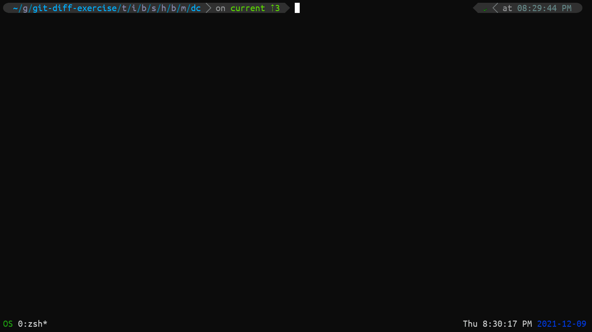

# SmartCd - A Mnemonist `cd` Command

## Description

A `cd` command with improved usability features, which can remember your recently visited directory paths and, search and directly traverse to sub-directories and as well as parent directories, all with Fuzzy searching.

## Features

- `smartcd` can remember the last 50 unique visited directory locations, where you can Fuzzy search and automatically traverse to the selected one.

  Syntax: `cd -- [string]`

  

- If the provided argument is not in your `$CDPATH`, then `smartcd` will present you with a list of all the *sub-directories* that matched the argument (performs sub-string comparison), where you can Fuzzy search & directly traverse to the selected path.

  Syntax: `cd string`

  

- `smartcd` can also search *parent-directories* based on the argument string provided. It will list all parent directories that matched the argument string (performs sub-string comparison), where you can fuzzy search and automatically traverse to the selected path.

  Syntax: `cd .. string`

  

## Why SmartCd

Initially, I tried `enhancd` which is a very good alternative for the inbuilt `cd` command, but the features of `enhancd` were more than enough for me and also I had to change my familiarity and regular habit with using some of the options or arguments that are often used with the inbuilt `cd` command, just to familiarize and adapt with the tool.

I started by making `smartcd` remember the last 20 unique visited paths using the `--` option. I wanted to keep `cd` as close to its native implementation, and at the same time increase its usability. The `--` option with the `cd` command was of no particular use to me, so I just provided an extra functionality to that option.

## Requirements

- [Fzf](https://github.com/junegunn/fzf)
- [Fd](https://github.com/sharkdp/fd)

Tested on [Zsh](https://www.zsh.org/) & [Bash](https://www.gnu.org/software/bash/).

### Optional requirement but recommended

Any tool that can *recursively list directories as a tree*.

`smartcd` has inbuilt support for [`exa`](https://github.com/ogham/exa) & `tree`, i.e., just install either `exa` or `tree`, and `smartcd` will handle the rest.

Otherwise, if you want to use any other tool, you need to export `REC_LISTING_CMD` env with your desired command (with options). 

Even if you want to use `exa` or `tree` with different options other than the default ones that `smartcd` is using, you can export `REC_LISTING_CMD` env specifying the command with your desired options.

## Installation

1. Download the `smartcd.sh` script.

   ```bash
   # using curl
   curl -O https://raw.githubusercontent.com/CodesOfRishi/smartcd/main/smartcd.sh
   # OR using wget
   wget https://raw.githubusercontent.com/CodesOfRishi/smartcd/main/smartcd.sh
   ```

2. Just put the below code in your shell configuration file (`.bashrc` and/or `.zshrc`).

   ```bash
   source path/to/smartcd.sh
   ```

   Where `path/to/smartcd.sh` is the path to the `smartcd.sh` script.

3. Open a new shell or reload your shell configuration file.

## Configurations
<details>
<summary><strong><code>SMARTCD_CONFIG_DIR</code></strong></summary>
<code>smartcd</code> stores logs in this location, which defaults to <code>~/.config/.smartcd</code>. To change location of the log file, export <code>SMARTCD_CONFIG_DIR</code> with your desired location.
</details>

<details>
<summary><strong><code>REC_LISTING_CMD</code></strong></summary> 
Command (with options) to use for recursive directory listing in tree format in <code>fzf</code> preview. If you want to use any other command export it with your desired command (with options).
</details>

<details>
<summary><strong><code>SMARTCD_HIST_SIZE</code></strong></summary> 
Set number of unique recently visited directory paths <code>smartcd</code> should remember. This defaults to 50.
</details>

## To Do

- [x] Users must be able to configure the number of unique last visited paths `smartcd` should remember.
- [ ] Make `fd` optional: Find alternative to the `fd` command used in the script using the `find` command.

## Inspiration

[enhancd](https://github.com/b4b4r07/enhancd)

## [LICENSE](https://github.com/CodesOfRishi/smartcd/blob/main/LICENSE)

The MIT License (MIT)

Copyright (c) 2021 Rishi K.
